# File Workspace Security and Protocol Specification

## Implementation Scope

This document specifies the implemented Phase 0 trust controls, Phase 1 explorer, Phase 2 individual transfers, and Phase 3 safe mutations with explicit permanent deletion. The product decision is to provide no managed trash or restore facility. Metadata writes and archive operations remain unavailable; the versioned capability contract is prepared to report those Phase 4 features without falsely advertising support.

The gateway owns operation and command identifiers, command signing, durable operation state, and audit records. It does not own local filesystem facts or configure per-agent filesystem grants. The agent owns automatic filesystem-root discovery, no-follow local reads, and capability discovery. It does not own agent identity. The website collects internal-user intent and displays gateway state. It does not authenticate or authorize browser users, communicate with an agent, or treat a client-authored path, entry, capability, or result as trusted. Deployment-level network access restrictions are the only access boundary for the website and dashboard API.

## Trust Sources and Data Classification

| Assertion | Classification | Trust source and permitted use |
| --- | --- | --- |
| Agent ID | Server-authored | Gateway derivation from the verified mTLS client certificate. It is the only agent identity used for authorization. |
| File request source | Server-authored | `FILE_OPERATOR_ID` is a configured audit label for requests originating from the internal website. It is not a user identity, credential, or authorization assertion. |
| Root ID, label, supported verbs | Client-authored | Agent enumeration of the local operating-system roots. A root ID is presentation and routing data, not identity or authorization evidence. |
| Operation ID, command ID, nonce, timestamps | Server-authored | Gateway generation. These fields drive state transition and replay decisions. |
| Selected root ID, relative path, page choice, preview range | Website-authored | Bounded and normalized by the gateway and agent only after the complete request is covered by a valid gateway signature. These fields are not identity or authorization evidence. |
| Entries, metadata, capabilities, preview bytes, manifests, checksums, mutation results, errors | Client-authored | Presentation, integrity comparison, and operation outcome only. The gateway does not use these fields as identity or authorization evidence. |
| Transfer, operation, command, and lease identifiers | Server-authored | Gateway generation. These fields scope durable state and data-plane access. |

## Runtime Contract

The shared command contract is `commandauth.Envelope` protocol version 1. The gateway signs a canonical JSON representation of every field except `signature` with RSA-PSS and SHA-256 using the configured TLS server private key. The agent pins the corresponding server certificate, verifies the key fingerprint, verifies the signature, requires its certificate-derived agent ID as the audience, enforces a maximum two-minute validity window, and persists the nonce before execution. The persisted replay history is bounded to 256 nonces. A command signed for a different agent, changed after signing, expired, issued too far in the future, replayed, or signed by another key is rejected.

The file protocol is `fileprotocol` version 4. Version 4 retains automatic root discovery, immutable transfer manifests, scoped leases, mutation preconditions, conflict strategies, per-item results, and explicit Phase 4 capability fields. It replaces managed trash and restore with the allowlisted `delete` mutation.

| Command | Required verb | Result |
| --- | --- | --- |
| `files.roots.list` | Root discovery | Client-authored local root and capability observations. Linux and macOS expose `/`; Windows exposes every currently available logical drive. |
| `files.directory.list` | Read-only | At most 500 entries. The dashboard requests 100 entries. |
| `files.metadata.get` | `metadata` | Common no-follow metadata plus explicit states for optional fields. |
| `files.preview.read` | `preview` | One regular-file range capped at one MiB. The dashboard requests 64 KiB. |
| `files.transfer.prepare` | `transfer` | Creates or freezes one single-file manifest before byte movement. |
| `files.transfer.resume` | `transfer` | Resumes from gateway-persisted chunk acknowledgements under a rotated lease. |
| `files.transfer.abort` | `transfer` | Idempotently cancels one transfer. |
| `files.operation.execute` | `mutate` | Plans or executes at most 100 allowlisted, preconditioned mutation items. |

The gateway accepts file results only on the authenticated mTLS channel and only when command ID and authenticated agent ID match one queued durable operation. Duplicate terminal states are idempotent. Unknown and cross-agent results are rejected.

Transfer bytes use a separate gateway data plane. Browser uploads pass through the dashboard API and receive no object-storage credential. Agents use a 256-bit random bearer capability delivered only inside a signed, expiring command and bound to one authenticated agent and transfer. Chunks are capped at four MiB, a file at one GiB, and a manifest at 256 chunks. The gateway verifies every SHA-256 chunk digest, persists acknowledgements, encrypts each staged chunk with AES-256-GCM, and verifies size and the complete SHA-256 digest before publication. The `not_scanned` result is an explicit classification, not a malware verdict.

The website computes upload manifests incrementally without retaining the complete file in memory, retries transient chunk-stage failures with bounded exponential delay, and displays hashing, staging, publication, and durable agent progress separately. Mutation dialogs submit an agent-validated dry run before enabling execution. Directory row actions expose single-item organization, content, and permanent-delete mutations; selection enables bounded bulk permanent deletion with per-item results. The destructive confirmation identifies deletion as irreversible.

## State Models

```mermaid
stateDiagram-v2
    [*] --> PersistedQueued: validate bounded request; persist operation
    PersistedQueued --> SignedQueued: bind command ID; sign and enqueue
    SignedQueued --> Completed: matching authenticated agent result
    SignedQueued --> Failed: rejection or dispatch failure
    Completed --> [*]
    Failed --> [*]
```



```mermaid
sequenceDiagram
    participant O as Internal website browser
    participant G as Gateway
    participant A as mTLS-authenticated agent
    O->>G: Root ID + normalized relative path
    G->>G: Validate bounded read-only request
    G->>G: Persist operation and append audit record
    G->>G: Sign version, audience, expiry, nonce, and payload
    A->>G: Poll over mTLS
    G-->>A: Signed command
    A->>A: Verify signature, audience, expiry, replay; persist nonce
    A->>A: Resolve reported root ID and walk components without following links
    A-->>G: Client-authored typed result over mTLS
    G->>G: Match authenticated agent and command; persist terminal state
    O->>G: Poll gateway operation ID
    G-->>O: Gateway state with client-authored result
```

## Automatic Root Discovery

The file workspace has no custom root policy, grant file, agent-ID match, role check, or browser permission check. Root discovery runs automatically whenever the explorer opens. Linux and macOS agents report one `filesystem` root backed by `/`. Windows agents enumerate logical drives and report stable identifiers such as `drive-c`. Local paths are resolved only by the agent and are never returned to the browser or written to the audit log.

Directory, metadata, and preview requests contain the selected root ID. The agent resolves that ID against its current operating-system root enumeration and rejects IDs that are not currently present. This is protocol validation, not an access policy. All reported roots support the implemented read-only list, metadata, and bounded-preview operations.

Relative paths use `/` as the protocol separator, are UTF-8, are limited to 4,096 bytes and 256 components, and reject empty components, `.`, `..`, NUL, backslash, CR, and LF. Directory enumeration returns a safe display name separately from the operation name. Entries whose native name cannot be represented safely in the normalized protocol remain visible but cannot be opened from the website.

On Linux and macOS, the adapter opens the operating-system root with `O_NOFOLLOW`, retains the root handle, and walks each component with handle-relative `openat` and `O_NOFOLLOW`. Metadata uses handle-relative no-follow stat. Preview accepts only a regular file opened from that handle chain. On Windows, the adapter rejects link/reparse-like entries during each path step, verifies containment within the selected drive, opens the target, and compares pre-open and post-open file identity for preview. The Windows capability document reports safe handle-relative I/O as unavailable because this fallback retains a residual rename race.

## Capability Matrix

Capabilities are client-authored presentation hints. Fixed protocol bounds and read-only command types remain authoritative.

| Capability | Linux | macOS | Windows |
| --- | --- | --- | --- |
| No-follow root opening | Available | Available | Available with platform fallback |
| Handle-relative component walk | Available | Available | Unavailable in the initial adapter |
| Directory link identification | Available | Available | Available for entries exposed as links/reparse-like objects by Go |
| Bounded regular-file preview | Available | Available | Available with pre/post identity comparison |
| POSIX mode observation | Available | Available | Unavailable |
| Owner, ACL, extended attributes | Unavailable | Unavailable | Unavailable |
| Atomic no-replace rename | Available | Available | Unavailable in the current fallback |
| Bounded permanent deletion of files and directory trees | Available subject to operating-system permissions | Available subject to operating-system permissions | Available subject to operating-system permissions and the documented containment fallback |
| Staged individual transfer | Available | Available | Available with the Windows containment fallback |
| Metadata writes and archives | Unavailable | Unavailable | Unavailable |

Unavailable capabilities are represented explicitly and are not emulated.

## Durable Storage, Retention, and Audit

The file workspace selects a gateway-local state directory configured by `GATEWAY_STATE_PATH`. Operation state is stored in `file-operations.json` with directory mode `0700`, file mode `0600`, temporary-file synchronization, and atomic rename. State is bounded to 10,000 operations. Completed or failed operations become eligible for pressure eviction after their operation expiry. Queued operations are not silently evicted.

Audit records are appended to `file-audit.jsonl` with mode `0600` and synchronized before a validated request is dispatched. Each record contains a monotonic sequence, previous-record hash, and SHA-256 hash of the complete record. Startup verifies the full chain and refuses to enable the workspace if sequence or hash validation fails. Records contain the configured request-source label, authenticated agent ID, operation and command IDs, root ID, operation type, trace ID, timestamp, and result classification. They exclude local paths, relative paths, file content, and metadata values. Automated audit deletion is not implemented; retention and archival are an operator-owned deployment policy.

Transfer state is stored in `file-transfers.json`; encrypted chunks are stored below `file-spool/`. `file-spool.key` is a gateway-local 256-bit key protected with mode `0600`. Transfer snapshots and chunk acknowledgements are synchronized before success is returned. Transfer records are bounded to 2,000, files to one GiB, chunks to 256, and retention to 24 hours. Expired records remove their spool directory. An operator may remove one terminal transfer or all terminal transfers for an agent; removal deletes only the gateway record and encrypted staging bytes, is audited before execution, and cannot remove an active transfer. It does not delete the source file or a browser-saved copy. The existing protobuf `FileChunk` is not used or extended.

Permanent deletion has no recovery mapping, retention payload, staging copy, or restore route. One requested directory tree is limited to 10,000 entries and 64 nested directory levels. The dry run enumerates the complete bounded tree without mutation; execution independently rebuilds the plan and removes entries in post-order. On Unix, enumeration and removal use root-bound, handle-relative, no-follow operations. The plan records the device, inode, and entry type and verifies that identity immediately before each removal. It rejects a directory mounted from a different device and any descendant that crosses a device boundary. Windows uses bounded `WalkDir` enumeration, does not follow symbolic links, verifies file identity before `os.Remove`, and retains the documented path-based containment race. A permission failure, concurrent change, or newly created child can produce a partial recursive deletion because filesystem removal is not transactional. The website warns that nested content is included but does not list every nested entry in its top-level operation review. Gateway operation state and the tamper-evident audit classification remain because destructive actions cannot bypass the gateway trust boundary. Legacy `file-trash.json` files and `.xenomorph-trash` directories created by earlier builds are not loaded, modified, or automatically purged; an operator must inspect and remove those historical artifacts explicitly.

## Website Access and Transport

The website and file API do not implement browser authentication, browser authorization, roles, or browser credentials. File workspace pages load immediately, discover roots automatically, and issue read, transfer, and mutation requests directly to the dashboard API. The gateway applies the same normalized root-relative path bounds to operator-authored transfer and mutation operands before dispatch; the agent independently validates the signed operands again before local execution. `FILE_OPERATOR_ID` defaults to `internal-website` and supplies only a server-authored audit source label; it does not identify an individual user and is not authorization evidence. The dashboard listener uses TLS 1.3 with the configured gateway server certificate. The deployment must restrict the dashboard listener and website to the intended internal network population. Browser authentication remains outside this implementation scope.

Administrative WebSocket upgrades require an exact `DASHBOARD_ALLOWED_ORIGIN` match; the secure default is `https://localhost:5173`. Agent media upgrades reject requests carrying a browser `Origin` header.

## Threat Model and Controls

| Threat | Implemented control | Residual condition |
| --- | --- | --- |
| Forged or changed command | RSA-PSS/SHA-256 over every command field; pinned key ID | TLS server key rotation must update the pinned agent certificate. |
| Replay or delayed command | Nonce persistence before execution, audience binding, two-minute expiry | Replay history is bounded; a replay older than 256 verified commands is also constrained by expiry. |
| Cross-agent confused deputy | Certificate-derived audience in signature; authenticated result match | None within the command channel. |
| Traversal and link escape | Normalized component allowlist; root handle; no-follow component walk | Windows reports the absence of a safe handle-relative primitive. |
| Unbounded directory, preview, transfer, or mutation | Hard caps on path, depth, page, cursor, request body, preview, file bytes, chunks, transfer records, and mutation items | Native-order cursor resumption performs bounded-memory rescanning proportional to cursor offset. |
| Transfer corruption or confused deputy | Per-chunk and full-object SHA-256, AES-GCM staging, authenticated agent match, scoped expiring capability, durable acknowledgements | Gateway-local key protection relies on host filesystem controls. |
| Mutation race or traversal | Preconditions, normalized operands, root-bound no-follow handles, handle-relative Unix mutation, atomic no-replace publish | Windows reports safe handle-relative I/O and atomic replace as unavailable; its adapter retains the documented platform race limitation. |
| Irrecoverable recursive deletion | Explicit destructive folder warning, two-step website dry-run review, source preconditions, no-follow traversal, fixed depth and entry limits, filesystem-boundary rejection on Unix, identity checks before removal, and tamper-evident audit classification | Successful deletion is intentionally irreversible; nested entries are not individually represented in the gateway result, execution can be partial after a concurrent change or local failure, the protocol accepts signed execution requests without a server-issued dry-run proof, and storage recovery is outside this feature. |
| Active content in preview | Agent returns opaque bytes; website renders decoded text only in escaped React text; binary is not rendered | Text classification is conservative, not a safety verdict. |
| Client claims used as identity | Agent identity comes only from mTLS; root observations never establish identity | Root and capability observations may become stale and local operations may still fail. |
| Audit alteration | Synchronized append-only file and verified hash chain | Host administrators can replace both state and the entire audit file; external immutable retention is required for stronger guarantees. |
| Unauthorized browser access | No application-level browser authentication is implemented by design | Deployment network controls must prevent unintended users from reaching the website and dashboard listener. |

These controls map to OWASP ASVS V1 architecture boundaries, V4 access control, V5 positive validation, V7 security logging, V9 TLS communications, V11 business logic, V12 file resources, and V13 API validation. They implement NIST SSDF PS.1 least-access storage and PS.2 tamper detection for the enabled slice.

## Acceptance Evidence

Unit and integration tests cover signature verification, signed-field tampering, expiry, replay, cross-agent commands and results, automatic root discovery, operation persistence before dispatch, audit-chain tampering, path traversal, unknown-root rejection, no-follow symlink listing, bounded pagination, bounded preview, encrypted transfer staging, checksum rejection, cross-agent lease rejection, atomic collision handling, stale mutation preconditions, symlink-parent rejection, dry-run non-mutation, permanent file deletion, empty-directory deletion, bounded recursive deletion, and preservation of targets referenced by nested symbolic links. Windows and macOS test binaries are compiled in addition to Linux execution. Repository release gates remain mandatory.
