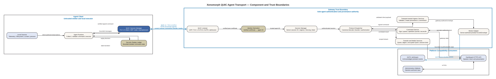
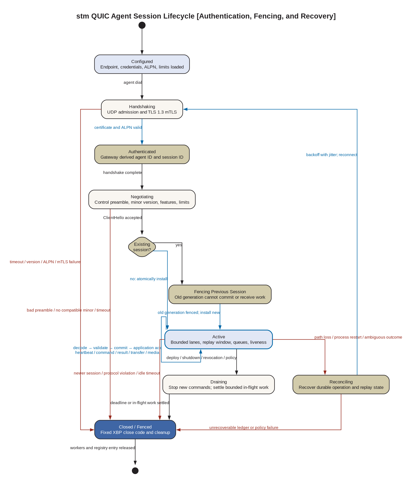

# QUIC and Custom Binary Agent Transport Plan

Status date: 2026-07-15.

Status: **repository implementation complete; QUIC is the required agent
runtime transport; production deployment evidence remains incomplete**.

Decision class: **large, trust-boundary and cross-component change**.

Implementation note: references below to HTTP/WebSocket agent routes,
dual-stack rollout, fallback, and later route removal describe the pre-cutover
baseline and the staged migration design. The current application starts no
agent HTTPS/WebSocket listener, the client contains no fallback transport, and
all agent heartbeat, attestation, log, command, transfer, and media traffic uses
QUIC. Dashboard HTTPS and gateway-to-NATS protobuf remain intentionally outside
the agent transport replacement.

Owning components: `platform/client`, `platform/services/gateway`, and
`platform/shared`. The administrative website and the gateway-to-NATS event
contract are compatibility consumers, not owners of the agent wire protocol.

## Executive Decision

The transport change is technically viable, but it should not be approved as
one indivisible rewrite. The recommended program is:

1. introduce a raw QUIC agent transport using `quic-go`, TLS 1.3 mutual
   authentication, a versioned ALPN identifier, long-lived multiplexed
   connections, and bounded reliable streams;
2. preserve the gateway as the only identity, authorization, provenance, and
   broker-publication boundary;
3. benchmark a candidate custom binary codec against both the current JSON
   agent wire shapes and deterministic protobuf before selecting it;
4. migrate one message family at a time under dual-stack compatibility; and
5. remove the HTTP/WebSocket agent plane only after rollback, mixed-version,
   replay, multi-client, and UDP-path evidence is complete.

QUIC and a custom codec solve different problems. QUIC removes request polling,
allows independent bidirectional streams, and provides congestion-controlled
reliable delivery over UDP. A custom codec may reduce serialization size and
CPU cost, but it also creates a permanent protocol-governance, parser-security,
tooling, and compatibility burden. Private field definitions are not a security
control. Confidentiality and integrity come from TLS 1.3, authenticated
identity comes from the verified client certificate, and command authenticity
comes from the gateway-owned command signature. The custom format should be
approved only if measured gains justify its lifetime cost.

The initial recommendation is therefore **approve the QUIC discovery and
prototype phases, but make the custom codec conditional on an explicit evidence
gate**. If the codec does not beat protobuf materially on representative total
system cost, use protobuf over raw QUIC and retain the same stream architecture.

## Why This Is Not a Library Substitution

The current agent plane consists of several HTTP-shaped contracts:

| Current flow | Present transport | Present serialization | Delivery behavior |
| --- | --- | --- | --- |
| Authentication and heartbeat | `POST /ingest/heartbeat` | JSON representation of protobuf heartbeat fields | One request and broker acknowledgement per heartbeat |
| Endpoint attestation | `POST /ingest/attestation` | JSON | One request per attestation |
| Client logs | `POST /ingest/logs` | JSON | Best-effort at the client; gateway publishes synchronously |
| Command delivery | `GET /commands/next` | JSON signed envelope | Five-second long polling against an in-memory per-agent queue |
| Command result | `POST /commands/result` | JSON, including base64 expansion for bytes | One result request and gateway publication |
| Live screen | WebSocket at `/screen/media` | Binary JPEG message | Independent reconnecting socket |
| Agent transfer chunks | HTTP `PUT`/`GET` and finalize `POST` | Raw chunk bytes plus route/header metadata | Four-MiB bounded chunks and application finalization |
| Gateway to NATS | NATS JetStream | Protobuf `EventEnvelope` | Synchronous durable publish acknowledgement |

Replacing these calls changes connection lifecycle, routing, concurrency,
backpressure, error reporting, request correlation, acknowledgement meaning,
retry behavior, resource accounting, deployment networking, and protocol
versioning. It must not change the following invariants:

- The gateway derives `agent_id` only from a client certificate verified during
  the TLS handshake.
- Client-authored payload fields remain untrusted observations.
- Operator-authored browser input remains untrusted intent.
- The gateway creates event IDs, session IDs, accepted timestamps, provenance,
  and broker subjects.
- Commands remain gateway-authored, audience-bound, expiring, and signed.
- The agent cannot publish directly to NATS and the website cannot connect
  directly to an agent.
- A transport acknowledgement never means that an operation executed or that a
  broker durably accepted an event.

## Scope

### Goals

- Maintain one authenticated, long-lived QUIC connection per active agent.
- Support many concurrently connected agents through one gateway UDP listener.
- Replace command polling with immediate server-to-agent delivery.
- Permit independent control, event, command, transfer, terminal, and media
  flows without connection-wide TCP head-of-line blocking.
- Define a compact, deterministic, canonical, and bounded binary framing and
  message contract shared by the client and gateway.
- Trace every accepted application message with a low-cost composite identity.
- Detect replay and duplicate processing within a connection and across
  reconnects according to explicit per-message semantics.
- Apply backpressure and quotas before untrusted input causes unbounded memory,
  goroutine, disk, broker, or logging work.
- Support mixed deployed versions and rollback without identity confusion,
  command duplication, or silent event loss.
- Produce byte-level specifications, golden vectors, fuzz corpora, operational
  metrics, and compatibility evidence as owned protocol artifacts.

### Non-goals

- Replacing the administrative dashboard HTTPS API. Browsers do not gain raw
  QUIC access in this program.
- Replacing NATS JetStream or its protobuf `EventEnvelope` in the first release.
- Designing cryptographic primitives, QUIC packet formats, congestion control,
  or TLS extensions in application code.
- Claiming security from an unpublished or private message registry.
- Enabling TLS/QUIC 0-RTT application data.
- Claiming exactly-once execution across process crashes or irreversible
  external side effects.
- Enabling unrestricted QUIC datagrams for screen, terminal, or file traffic.
- Solving multi-region or active-active gateway routing in the first release.
- Changing command capabilities, filesystem authorization, or operator
  authentication as an incidental part of the transport migration.

## Required Decisions Before Implementation

The architecture owner and gateway security owner must record these decisions
in an ADR before production code is enabled:

| Decision | Recommended initial choice | Reason and consequence |
| --- | --- | --- |
| Raw QUIC or HTTP/3 | Raw QUIC | The target is a private framed application protocol, not HTTP semantics. HTTP/3 would preserve request semantics and add QPACK/HTTP framing that this design does not need. |
| Application ALPN | `xenomorph-agent/1` | Separates this protocol from HTTP/3 and makes incompatible major versions fail during negotiation. The exact registered/private token must be frozen before release. |
| QUIC version | QUIC v1 for the first production profile | Minimizes initial interoperability surface. A later fleet-wide process may add QUIC v2 after explicit compatibility testing. |
| TLS mode | TLS 1.3 with required and verified client certificates | Preserves the existing identity boundary. Application messages are not processed before handshake completion and peer-certificate validation. |
| 0-RTT | Disabled | TLS early data is replayable. No heartbeat, command result, transfer, log, or mutation is safe by default in 0-RTT. |
| Connection per agent | One active connection per certificate-derived agent ID | Gives one ownership and fencing point. A replacement connection receives a new gateway session and fences the old connection. |
| Duplicate connection policy | Authenticate the new connection, atomically install it, then close the old session as replaced | Allows recovery after a broken path without allowing two live command consumers. The registry comparison must reject late frames from the replaced session. |
| Custom codec | Conditional | It must pass the size, CPU, allocation, security, and maintenance gate against protobuf. |
| Broker encoding | Keep protobuf initially | Prevents an agent transport migration from also becoming a durable event-store migration. The gateway translates validated binary payloads into server-authored protobuf envelopes. |
| Client replay state | Persist a minimal security ledger | Strong replay protection across client restart conflicts with the current stateless replay contract. The ledger is security state, not a diagnostic log, and requires its own durability, privacy, and recovery specification. |
| HTTP fallback after migration | Disabled by default after fleet cutover | A permanent automatic UDP-to-HTTP fallback creates a downgrade path and doubles the supported protocol surface. Dual stack is a rollout mechanism with an expiry. |
| QUIC datagrams | Experimental feature only | Datagrams are unreliable, have path-size constraints, lack application flow control, and the current `quic-go` documentation does not recommend its datagram path for high throughput. |

## Target Architecture



The editable source is
[`quic-agent-transport-architecture.dot`](../diagrams/quic-agent-transport-architecture.dot).

The connection and replacement lifecycle is shown separately because mixing
component ownership and detailed state transitions makes either view difficult
to review:



The editable source is
[`quic-agent-session-lifecycle.dot`](../diagrams/quic-agent-session-lifecycle.dot).

### Ownership and trust classification

| Component | Owns | Does not own | Trust source |
| --- | --- | --- | --- |
| Agent QUIC runtime | Connection initiation, local telemetry collection, local execution, bounded stream writers/readers, command verification, local replay ledger | Agent identity assertion, command authorship, operator authorization, accepted event time | Verified gateway certificate and command public key; its own certificate only computes expected command audience locally |
| Gateway QUIC listener | UDP socket, QUIC/TLS termination, handshake limits, ALPN, connection admission, stream acceptance | Truth of payload fields or execution results | TLS 1.3 verified client certificate |
| Gateway session manager | Certificate-derived agent ID, server session ID, replacement/fencing state, per-session limits, message receipt identity | Durable command intent or broker durability by itself | Authenticated connection plus gateway process state; distributed mode later requires a shared lease authority |
| Gateway protocol dispatcher | Canonical decode, schema validation, message authorization, application acknowledgement, translation to internal types | Certificate validation or operator authentication | Identity supplied by the accepted gateway session, never a payload field |
| Shared wire module | Framing, field encodings, message registry, generated codecs, golden vectors, protocol documentation | Runtime trust, authorization, persistence, networking | Reviewed schema source and generator output |
| Existing command service | Gateway-generated command ID, audience, expiry, nonce, signature, dispatch state | Agent execution truth | Gateway key service and authenticated session binding |
| Existing broker adapter | Protobuf envelope marshal and acknowledged JetStream publication | Agent identity derivation or client payload truth | Gateway-authored envelope and secured broker identity |
| Dashboard HTTPS API | Operator intent collection and presentation | Agent transport, agent identity, command authenticity | Gateway responses; operator input remains operator-authored |

### Boundary rule

`ClientHello`, stream preambles, message headers, message sequences, feature bits,
telemetry, command results, file bytes, terminal output, and screen frames are
client-authored when sent by an agent. They may route parsing but may not assert
identity. The gateway obtains the authenticated agent from the connection
session object before opening any application dispatcher. No message contains
an accepted `agent_id` field.

## QUIC Transport Profile

### Listener and TLS profile

The gateway should create one long-lived `net.UDPConn` and one
`quic.Transport` for the configured agent address. The transport owns the UDP
socket for its full lifetime. The initial server profile must set:

- TLS `MinVersion` to TLS 1.3;
- `ClientAuth` to `tls.RequireAndVerifyClientCert`;
- the client CA pool from externalized enrollment material;
- a server certificate chain appropriate for QUIC's handshake amplification
  limit;
- `NextProtos` to only the approved agent ALPN;
- an explicit initial QUIC version set;
- bounded handshake and idle timeouts;
- bounded connection and stream receive windows;
- bounded incoming bidirectional and unidirectional stream counts;
- `Allow0RTT` false;
- datagrams disabled unless a later negotiated experiment enables them;
- a confidential, persistent stateless-reset key; and
- a confidential, rotated, fleet-consistent token key if address-validation
  tokens are used across gateway restarts or instances.

The client profile must load its certificate and key from externalized
credential paths, use an explicit CA pool, set the exact production
`ServerName`, offer only the approved ALPN, require TLS 1.3, and refuse an
unrecognized protocol. `InsecureSkipVerify` is prohibited.

QUIC v1 uses TLS 1.3, but that fact does not automatically configure mutual
authentication. The same certificate-validation requirements currently
enforced by the HTTPS listener must be reproduced in the QUIC TLS
configuration. The gateway waits for the handshake to complete before it
derives identity or consumes application bytes. This prevents server 0.5-RTT
data from being treated as delivery to an authenticated client.

### Address validation and denial-of-service controls

Before client identity is known, controls can rely only on network observations
and cryptographic address validation. They must not create an identity record.
The gateway needs:

- a global cap on concurrent incomplete handshakes;
- a bounded per-source-prefix handshake rate with conservative treatment of
  carrier-grade NAT and shared enterprise networks;
- QUIC Retry or token-based address validation when the deployment threat model
  requires amplification resistance;
- handshake timeouts and certificate-chain size/depth limits;
- no application goroutines, session registry entry, large buffer pool, broker
  work, or command lookup before certificate verification;
- a cap on accepted connections and a defined overload response;
- metrics for failed version negotiation, ALPN rejection, certificate failure,
  Retry validation, timeout, and overload, without logging raw certificates;
- UDP receive-buffer and kernel-drop monitoring; and
- firewall rules that expose only the configured UDP agent port and keep the
  dashboard listener separate.

Rate limiting by IP is an abuse signal, not identity or authorization evidence.
Connection migration or NAT rebinding can change the observed remote address.
The gateway retains the certificate-derived agent ID and records address
changes only as untrusted operational metadata.

### Connection lifecycle

1. The agent resolves the configured gateway endpoint and opens a QUIC v1
   connection with the agent ALPN and client certificate.
2. The gateway completes TLS 1.3 mutual authentication, derives `agent_id` from
   the verified leaf certificate, and creates an unguessable 128-bit
   `session_id` plus an in-process session generation.
3. The agent opens exactly one client-initiated bidirectional control stream and
   sends the stream preamble and `ClientHello` as the first application frame.
4. The gateway validates the preamble, version range, features, build metadata
   bounds, and connection state. It sends `ServerHello` containing the selected
   protocol minor version, server-authored session ID, required lanes, heartbeat
   cadence, and negotiated limits.
5. The session manager atomically installs this connection for `agent_id`. If an
   older session exists, it is marked fenced before the new session becomes
   command-eligible. The old connection receives `SessionReplaced` when
   possible and is closed.
6. Both peers open only the negotiated mandatory streams. The gateway does not
   dequeue a command until the command lane is ready.
7. The session remains active while application heartbeats and QUIC connection
   activity satisfy the configured liveness contract. QUIC keepalive prevents
   idle NAT expiry; it does not replace application heartbeat telemetry.
8. On planned shutdown the gateway sends `Drain`, stops assigning commands,
   allows bounded in-flight work to settle, closes streams, and closes the
   connection with an application code. On failure, both sides reconcile from
   durable operation state after reconnect.

### Stream topology

Every application stream starts with a canonical stream preamble. The stream's
initiator and direction must match its kind; a mismatch is a protocol error.

| Kind | Code | Initiator / direction | Lifetime | Contents | Initial policy |
| --- | ---: | --- | --- | --- | --- |
| Session control | `0x00` | Client / bidirectional | Connection | hello, welcome, ping, pong, drain, structured error, capability update | Exactly one; mandatory |
| Agent events | `0x01` | Client / unidirectional | Connection | heartbeat, attestation, log entry, command result, operation status | Exactly one; mandatory |
| Gateway commands | `0x02` | Server / unidirectional | Connection | signed command dispatch and cancellation | Exactly one; mandatory |
| Transfer | `0x03` | Either / bidirectional | One transfer or bounded transfer segment | open, chunk, durable chunk acknowledgement, finalize, abort | Concurrent count and byte quota |
| Terminal | `0x04` | Gateway / bidirectional | One terminal session | terminal open, input, output, resize, signal, close | Reserved until PTY protocol approval |
| Screen media | `0x05` | Client / unidirectional | One media generation | metadata and reliable bounded frames | Feature-gated; lossy mode deferred |
| Protocol diagnostics | `0x06` | Either / bidirectional | Short lived | conformance probe in non-production builds | Disabled in production |
| Reserved | `0x07`-`0x3f` | None | None | Future reviewed assignments | Receipt closes the stream |

QUIC stream IDs are transport identifiers and are not application message type
IDs. The application records the QUIC stream ID for tracing, but it never
assumes that stream IDs arrive in order across stream kinds.

The control, event, and command lanes are long-lived to avoid stream creation
for each small message. Transfers and future terminals use independent streams
so a blocked file or terminal flow does not block command delivery. Screen
media uses an independent reliable stream in the first release. A loss on that
stream can delay later bytes on that stream; the sender therefore maintains at
most one bounded frame backlog and drops stale frames before writing. A later
experiment may use one stream per bounded frame or QUIC datagram fragments only
after measurement.

### Backpressure and scheduling

QUIC flow control bounds bytes in transport, but it does not bound decoded
objects, broker work, disk staging, audit records, or application queues. Each
session must have separate bounded queues:

| Priority | Traffic | Full-queue behavior |
| --- | --- | --- |
| 0 | Security close, drain, command cancellation, protocol error | Reserve capacity; if unavailable, close the connection |
| 1 | Command dispatch and result acknowledgement | Stop dequeuing new commands; surface overload to the gateway command state |
| 2 | Heartbeat, operation state, attestation | Coalesce only where the message contract allows it; otherwise reject with retry classification |
| 3 | Client diagnostic logs | Drop according to the documented best-effort policy and increment a bounded metric |
| 4 | Transfer chunks | Block the stream within deadline or return busy; never buffer an unbounded transfer in memory |
| 5 | Live media | Drop oldest unsent frame; never delay commands or retain an unbounded frame history |

The implementation must not create one unbounded goroutine per frame. A
connection supervisor owns a fixed set of long-lived lane loops and a bounded
number of per-operation workers. Every goroutine ends when the connection
context is canceled. Writes to a given stream have one owner because concurrent
writes would make application frame ordering and shutdown ambiguous.

## Candidate Xenomorph Binary Protocol Version 1

This section is a **candidate normative baseline for prototyping**. It becomes
the wire standard only after the protocol ADR, threat review, golden corpus,
and benchmark gate are approved. The working name in this plan is **XBP/1**
(Xenomorph Binary Protocol major version 1).

### Design requirements

- Deterministic: one logical value has one accepted byte representation.
- Incrementally parseable: readers can reject an oversized frame before
  allocating its body.
- Compact: common scalar fields use canonical unsigned varints; schemas use
  positional fields rather than transmitting field names or tags.
- Bounded: every frame class, field, collection, nesting level, and allocation
  has a documented maximum.
- Versioned: ALPN selects the major protocol; hello negotiation selects one
  minor version and feature set; each message carries a schema revision.
- Extensible without ambiguity: IDs are never reused, removed IDs are
  tombstoned, reserved flag bits must be zero, and optional fields use explicit
  presence maps.
- Safe to sign: signed structures have a domain-separated canonical byte form
  independent of in-memory structs.
- Transport-independent in tests: codecs operate on `io.Reader`/`io.Writer`
  and byte slices without importing `quic-go`.
- Observable without exposing content: the frame header supplies a cheap
  sequence identity, while payload logging remains prohibited.

### Stream preamble

The first six bytes of every application stream are fixed:

```text
Offset  Size  Field            Value / encoding
0       2     magic            0x58 0x42 (ASCII "XB")
2       1     protocol_major   0x01
3       1     stream_kind      Registry code above
4       1     stream_revision  0x01
5       1     preamble_flags   0x00 in XBP/1; unknown bits are fatal
```

The magic is a stream resynchronization and diagnostic marker, not a security
mechanism. TLS and QUIC authenticate the stream bytes. A wrong magic, major,
direction, initiator, kind, or reserved flag causes that stream to be reset
with `XBP_STREAM_PREAMBLE`, and repeated violations close the connection.

### Frame layout

After the preamble, a stream contains zero or more frames:

```text
+----------------------+-----------------------------------------------+
| Field                | Encoding                                      |
+----------------------+-----------------------------------------------+
| frame_length         | canonical ULEB128 uint32; bytes after itself  |
| message_type         | canonical ULEB128 uint16                      |
| schema_revision      | uint8                                         |
| flags                | uint8                                         |
| message_sequence     | canonical ULEB128 uint64, starts at 1         |
| correlation_sequence | ULEB128 uint64 when HAS_CORRELATION is set    |
| operation_id         | 16 opaque bytes when HAS_OPERATION_ID is set  |
| body                 | exact message schema bytes                    |
+----------------------+-----------------------------------------------+
```

`frame_length` counts from the first byte of `message_type` through the last
body byte. It does not include its own varint. A decoder reads at most five
bytes for `frame_length`, verifies canonical form and the stream-kind limit,
then uses a limited reader. It must consume exactly `frame_length` bytes. A
short body, trailing body bytes not defined by the negotiated schema, overlong
varint, overflow, or limit violation rejects the frame.

The common case has no correlation or operation ID. With one-byte length,
type, and sequence values, the minimum frame overhead is five bytes:
`length`, `type`, `revision`, `flags`, and `sequence`. This number is a codec
property, not total on-wire overhead; QUIC and UDP packet headers, ACKs, TLS
protection, and packetization must be included in performance comparisons.

### Flags

| Bit | Name | Meaning |
| ---: | --- | --- |
| 0 | `ACK_REQUIRED` | Receiver must send an application `MessageAck` after the message reaches its defined commit point. |
| 1 | `IS_RESPONSE` | Message is a response and must also set `HAS_CORRELATION`. |
| 2 | `HAS_CORRELATION` | `correlation_sequence` follows `message_sequence`. |
| 3 | `HAS_OPERATION_ID` | A 16-byte stable operation or idempotency identifier follows correlation. |
| 4 | `SENSITIVE` | Payload must not be included in diagnostic capture; this is a handling marker, not encryption. |
| 5 | `END_OPERATION` | This is the final application frame for an operation. |
| 6-7 | Reserved | Must be zero in XBP/1. |

Compression is deliberately absent from XBP/1. Compression ratios can leak
secrets when attacker-controlled and secret values share a compression
context, and decompression introduces CPU and expansion attacks. Media codecs
and archive formats are payload-specific and retain their own existing limits.

### Primitive encodings

| Primitive | Canonical representation | Validation |
| --- | --- | --- |
| `uvarint` | Unsigned LEB128, least-significant seven-bit groups first | Shortest possible form only; max 10 bytes for `uint64`, 5 for `uint32`, 3 for `uint16` |
| `svarint` | ZigZag transform followed by canonical `uvarint` | Reject overflow and overlong input |
| `bool` | One byte, `0x00` false or `0x01` true | All other values invalid |
| `fixed32` | Four bytes, IEEE 754 or unsigned integer as specified, little-endian | Floating fields reject NaN and infinities unless a schema explicitly permits them |
| `fixed64` | Eight bytes, IEEE 754 or unsigned integer as specified, little-endian | Same bounded semantic validation |
| `bytes` | `uvarint byte_length` followed by exact bytes | Per-field and containing-frame limits checked before allocation |
| `string` | `bytes` containing UTF-8 | Valid UTF-8, no NUL unless explicitly allowed, field-specific trimming/normalization and byte limit |
| `uuid` | Exactly 16 bytes in RFC 4122 network byte order | Variant/version requirements are field-specific; opaque IDs are not rewritten |
| `timestamp_ms` | `uvarint` milliseconds since Unix epoch UTC | Accepted range and clock-skew policy are message-specific; client time is never gateway truth |
| `ratio_ppm` | `uvarint` in `[0, 1_000_000]` | Replaces ambiguous floating ratios where loss of sub-ppm precision is acceptable |
| `list<T>` | `uvarint count`, then exactly `count` canonical elements | Count cap and aggregate encoded-byte cap |
| optional map | `uvarint map_byte_length`, then little-bit-order presence bytes | Map must be shortest length that includes the highest present field; unused high bits are zero |

The generator must not use Go's `binary.Read` directly over externally sized
structs or use reflection in the production hot path. Decoders append into
pre-sized bounded slices only after validating count and remaining byte budget.
Strings are validated before conversion when this avoids retaining a large
backing buffer.

### Worked byte example

The following candidate vector demonstrates the level of precision required in
the generated reference. It is illustrative until the registry enum values are
ratified.

A session-control stream begins with:

```text
58 42 01 00 01 00
│  │  │  │  │  └─ preamble_flags = 0
│  │  │  │  └──── stream_revision = 1
│  │  │  └─────── stream_kind = session control (0)
│  │  └────────── protocol_major = 1
└──┴───────────── magic = "XB"
```

Assume the provisional log enums `INFO=1`, `client.runtime=1`, and
`runtime_started=1`. The first event-lane `LogEntry` revision 1 with
`ACK_REQUIRED`, no detail, and sequence 1 is:

```text
09 82 02 01 01 01 01 01 01 00
│  └──┴─┘ │  │  │  │  │  │  └─ detail string byte length = 0
│     │    │  │  │  │  │  └──── event code = runtime_started (1)
│     │    │  │  │  │  └─────── component = client.runtime (1)
│     │    │  │  │  └────────── level = INFO (1)
│     │    │  │  └───────────── message_sequence = 1
│     │    │  └──────────────── flags = ACK_REQUIRED (0x01)
│     │    └─────────────────── schema_revision = 1
│     └──────────────────────── message_type = 0x0102 as ULEB128 82 02
└────────────────────────────── frame_length = 9 bytes after this field
```

The decoder must reject the semantically identical type encoded overlong as
`82 82 00`, a frame length larger than the event-lane limit, a missing final
detail-length byte, any trailing byte, or any enum value outside the negotiated
registry. Every final message schema requires vectors in this annotated form,
plus machine-readable binary files consumed by both peers' tests.

### Message sequence and receipt identity

Each sender allocates a monotonically increasing `uint64` sequence across all
frames in one authenticated session, beginning at 1. Zero is invalid. The
composite receipt identity is:

```text
(gateway_session_id, sender_role, message_sequence)
```

This avoids a random UUID allocation and 16 wire bytes on every message while
remaining unique within the gateway-authored session. Sequence allocation may
use one atomic counter per direction. Receivers maintain a bounded sliding
replay window because independent QUIC streams can arrive out of order. A seen
sequence is rejected as a duplicate; a sequence older than the retained window
is rejected as stale. A large forward jump outside the configured gap limit is
a protocol violation rather than an instruction to allocate a huge bitmap.

Sequence state is connection-scoped and does not provide retry idempotency
across reconnects. Side-effecting operations therefore carry a stable
gateway-authored 128-bit `operation_id` and use the durable rules described in
the replay section.

### Message type registry

Type IDs are protocol constants, not Go enum ordinals. The registry source is
append-only. An ID is never reassigned, even after message removal.

| Range | Owner | Candidate assignments |
| --- | --- | --- |
| `0x0000`-`0x003f` | Session control | `ClientHello=0x01`, `ServerHello=0x02`, `Ping=0x03`, `Pong=0x04`, `MessageAck=0x05`, `ProtocolError=0x06`, `Drain=0x07`, `SessionReplaced=0x08` |
| `0x0040`-`0x007f` | Protocol capability | capability update and limit update; unassigned in initial release |
| `0x0100`-`0x01ff` | Agent event ingress | `Heartbeat=0x0100`, `Attestation=0x0101`, `LogEntry=0x0102` |
| `0x0200`-`0x02ff` | Command plane | `Command=0x0200`, `CommandResult=0x0201`, `CommandCancel=0x0202`, `CommandState=0x0203` |
| `0x0300`-`0x03ff` | Transfer plane | `TransferOpen=0x0300`, `TransferChunk=0x0301`, `TransferChunkAck=0x0302`, `TransferFinalize=0x0303`, `TransferAbort=0x0304` |
| `0x0400`-`0x04ff` | Terminal plane | Reserved for a separately approved PTY protocol |
| `0x0500`-`0x05ff` | Screen plane | `MediaOpen=0x0500`, `MediaFrame=0x0501`, `MediaClose=0x0502` |
| `0x0600`-`0x06ff` | Diagnostic/conformance | Disabled in production |
| `0x0700`-`0x3fff` | Future repository-owned | Requires schema and threat review |
| `0x4000`-`0xffff` | Reserved/invalid in XBP/1 | Must not be emitted |

### Selected schema definitions

These schemas define enough detail to build the benchmark prototype. The final
registry must contain the same level of documentation for every command and
file structure before that family migrates.

#### `ClientHello` revision 1

| Order | Field | Encoding | Bound | Trust |
| ---: | --- | --- | --- | --- |
| 1 | minimum minor | `uvarint uint16` | `0` initially | Client-authored negotiation input |
| 2 | maximum minor | `uvarint uint16` | `0` initially; must be >= minimum | Client-authored negotiation input |
| 3 | features | `uvarint uint64` bitmap | Unknown required bits reject; optional unknown bits ignored only by rule | Client-authored capability claim |
| 4 | implementation version | `string` | 64 bytes | Client-authored diagnostic label |
| 5 | platform | enum `uvarint` | Allowlisted Linux, macOS, Windows values | Client-authored capability claim |
| 6 | architecture | enum `uvarint` | Allowlisted amd64, arm64 values | Client-authored capability claim |
| 7 | client instance nonce | 16 bytes | Nonzero random value | Correlation only; never identity or replay authority |

No agent ID, certificate fingerprint, role, authorization, or trusted timestamp
is accepted in `ClientHello`.

#### `ServerHello` revision 1

| Order | Field | Encoding | Bound | Authority |
| ---: | --- | --- | --- | --- |
| 1 | selected minor | `uvarint uint16` | Within offered intersection | Gateway-authored |
| 2 | negotiated features | `uvarint uint64` | Subset permitted by gateway policy | Gateway-authored |
| 3 | session ID | 16 bytes | Unpredictable, nonzero | Gateway-authored |
| 4 | heartbeat interval ms | `uvarint uint32` | Production policy, initially 10-30 seconds | Gateway-authored |
| 5 | maximum idle ms | `uvarint uint32` | Greater than heartbeat grace | Gateway-authored |
| 6 | event frame maximum | `uvarint uint32` | No larger than configured lane cap | Gateway-authored |
| 7 | concurrent transfer streams | `uvarint uint16` | Bounded per agent | Gateway-authored |
| 8 | command verification key ID | `string` | 128 bytes | Gateway-authored identifier, not key material |

#### `Heartbeat` revision 1

The heartbeat retains current behavior while replacing four ratio floats with
parts-per-million integers. Every field is client-authored. The gateway range
checks and normalizes it before constructing a protobuf event.

| Order | Field | Encoding | Limit |
| ---: | --- | --- | --- |
| 1 | optional presence map | optional map | Covers optional fields 0-29 |
| 2 | hostname | `string` | 120 bytes |
| 3 | OS version | `string` | 120 bytes |
| 4 | CPU load | `ratio_ppm` | `[0, 1_000_000]` |
| 5 | RAM usage | `ratio_ppm` | `[0, 1_000_000]` |
| 6 | uptime seconds | `uvarint uint64` | Operational maximum selected by schema |
| 7 | CPU model | `string` | 160 bytes |
| 8 | CPU cores | `uvarint uint16` | `0..4096` |
| 9 | CPU threads | `uvarint uint16` | `0..8192` |
| 10 | total RAM bytes | `uvarint uint64` | No identity meaning |
| 11 | GPU devices | `list<string>` | 32 entries, 160 bytes each, 4 KiB aggregate |
| 12 | network name | `string` | 120 bytes |
| 13 | network addresses | `list<string>` | 64 entries, 64 bytes each, 4 KiB aggregate |
| 14 | kernel version | `string` | 120 bytes |
| 15 | CPU frequency MHz | `uvarint uint64` | Range checked |
| 16 | network online | `bool` | Exact byte |
| 17 | link speed Mbps | `uvarint uint64` | Range checked |
| 18 | network type | enum `uvarint` | Allowlisted plus unknown |
| 19 | total storage bytes | `uvarint uint64` | Range checked |
| 20 | available storage bytes | `uvarint uint64` | Must not be trusted as <= total without validation |
| 21 | network SSID | `string` | 128 bytes; never a credential |
| 22 | used storage bytes | `uvarint uint64` | Range checked |
| 23 | storage usage | `ratio_ppm` | `[0, 1_000_000]` |
| 24 | inode usage | `ratio_ppm` | `[0, 1_000_000]` |
| 25 | storage device | `string` | 160 bytes |
| 26 | storage filesystem | `string` | 64 bytes |
| 27 | storage mountpoint | `string` | 4,096 bytes; sensitive handling |
| 28 | storage model | `string` | 160 bytes |
| 29 | storage type | enum `uvarint` | Allowlisted plus unknown |
| 30 | storage read-only | `bool` | Exact byte |
| 31 | application types | `list<category,count>` | 64 categories; allowlisted category enum and `uvarint uint32` count |

Optionality must be explicit. An absent measurement and a measured zero are not
interchangeable. The prototype must compare the size impact of the presence map
with separate static and dynamic heartbeat messages; splitting rarely changing
inventory from frequent liveness telemetry may save more bytes than any scalar
encoding choice.

#### `LogEntry` revision 1

| Order | Field | Encoding | Limit |
| ---: | --- | --- | --- |
| 1 | level | enum `uvarint` | DEBUG, INFO, WARN, ERROR |
| 2 | component | enum or bounded `string` escape | Registry code preferred; escape maximum 120 bytes |
| 3 | event code | enum `uvarint` | Fixed registry; replaces free-form known messages |
| 4 | optional detail | `string` | Empty in initial client contract; maximum 512 bytes if later approved |

The initial client should emit registry codes for existing fixed events instead
of strings such as `event=command_completed`. It must not transmit raw errors,
addresses, paths, terminal contents, command payloads, credentials, or bodies.

#### `Command` revision 1 transport wrapper

The first migration wraps the existing signed command envelope as bounded bytes
inside XBP, retaining signature compatibility. A second separately reviewed
command-signature protocol may replace JSON canonicalization with canonical
binary signed bytes. The replacement signed input must use domain separation:

```text
"XENOMORPH-COMMAND\x00" || command_signature_version ||
canonical_unsigned_command_length || canonical_unsigned_command
```

The signature field itself is excluded. The canonical unsigned command includes
the protocol version, 16-byte gateway command ID, 16-byte audience agent ID,
registered command type, exact payload bytes and payload revision, requester
label, issued and expiry timestamps, 16-byte nonce, reason, and key ID. The
gateway signs only after all values are final. The agent verifies the signature,
key ID, audience derived from its local certificate, type, time window, payload
bounds, and durable replay state before execution.

No deployment may send binary-signed v2 commands until all targeted agents have
the verification implementation and the gateway supports an overlap window for
old and new key/signature versions. A signature-format migration must not share
one version number with the transport framing migration.

#### `CommandResult` revision 1

The header must set `HAS_OPERATION_ID`; the operation ID is the gateway command
ID in binary form. Body fields are: registered command type, result state enum,
bounded reason code plus optional bounded reason text, client-observed response
time, bounded hostname observation, terminal metadata where applicable, bounded
opaque result bytes with an explicit payload schema revision, and per-command
result classification. Screenshot bytes move on the media plane and file bytes
move on the transfer plane rather than expanding the command result frame.

The gateway accepts a result only when the authenticated agent matches the
command audience and the durable command state permits the transition. A
duplicate identical terminal result receives the prior receipt; a conflicting
result for a terminal command state is rejected and audited.

#### Transfer messages revision 1

- `TransferOpen` carries the gateway transfer ID, signed capability, direction,
  immutable manifest digest, expected total size, chunk size, and expiry.
- `TransferChunk` sets `HAS_OPERATION_ID` and carries chunk index, exact chunk
  length, chunk digest algorithm ID, 32-byte SHA-256 digest, and bounded bytes.
- `TransferChunkAck` correlates to the chunk frame and is emitted only after the
  gateway has verified, encrypted, persisted, and synchronized the owned chunk
  acknowledgement required by the file workspace contract.
- `TransferFinalize` carries expected chunk count, total size, and whole-object
  digest.
- `TransferAbort` carries an allowlisted reason code and no file content.

QUIC reliable delivery does not replace per-chunk digest verification or durable
application acknowledgements. Retransmitted QUIC packets do not duplicate
stream bytes, but reconnect can repeat an application chunk. The durable
transfer store returns the existing acknowledgement when transfer ID, chunk
index, length, and digest match; it rejects conflicts.

#### Media messages revision 1

`MediaOpen` declares a gateway-authorized media generation, codec enum,
dimensions, frame-rate cap, and maximum encoded frame bytes. `MediaFrame`
carries a generation ID, monotonically increasing frame number, client capture
time observation, keyframe flag where relevant, content type enum, and bounded
encoded bytes. `MediaClose` carries a reason code and last frame number.

The initial reliable mode never queues more than one unsent frame per agent.
When congestion prevents timely delivery, the client drops the stale unsent
frame and records a counter; it does not open unlimited streams or build a
memory queue. The gateway validates media authorization against its active
screen session and never uses frame metadata as identity evidence.

### Application acknowledgement

`MessageAck` is a correlated control message containing:

- original sender sequence;
- status enum: `accepted`, `duplicate`, `rejected`, `busy`, or `failed`;
- commit enum: `decoded`, `validated`, `persisted`, `published`, or
  `operation_terminal`;
- gateway receipt/event ID when one was created;
- retry classification: `never`, `same_operation`, or `new_operation`; and
- a bounded public error code, not a raw internal error.

Each message definition fixes its success commit point. Heartbeat and log
success require acknowledged broker publication under the current contract.
Transfer chunk success requires durable chunk acknowledgement. Command result
success requires a valid command-state transition and its required persistence
and publication. Media frames normally do not request per-frame application
acknowledgement.

## Duplicate, Replay, and Idempotency Model

The term “exactly once” must not appear as a release guarantee. QUIC guarantees
an ordered reliable byte stream within one connection; it does not provide one
execution across application retry, reconnect, gateway failover, client crash,
or an irreversible operating-system side effect.

### Protection layers

| Layer | Key | Lifetime | Detects | Does not detect |
| --- | --- | --- | --- | --- |
| QUIC packet protection | Packet number and TLS traffic keys | Connection key phase | Packet alteration and replay within QUIC processing | Application retry on a new stream/connection |
| XBP session replay window | Session ID, sender role, message sequence | One authenticated session | Duplicate/replayed frame sequence and pathological gaps | Same operation retried in a new session |
| Gateway operation journal | Authenticated agent ID, operation ID, operation type | Retention plus safety margin | Repeated side-effect request/result across reconnect or gateway restart | Side effect completed but journal not committed unless operation protocol reconciles it |
| Agent command replay ledger | Gateway key ID, command ID/nonce, audience, terminal state | At least command validity plus incident window | Replayed signed command across client restart | Compromise or loss of the local security ledger |
| Transfer store | Agent ID, transfer ID, chunk index, digest | Transfer retention | Repeated chunk/finalize | Different transfer with duplicated content, which is not a replay |

### Durable client replay ledger

The current client deliberately keeps verified command nonces only in memory.
That is incompatible with strong restart replay protection. The new design must
either approve residual restart replay risk or persist minimal security state.
This plan recommends persistence with these constraints:

- Store only command ID, nonce digest, key ID, issued/expiry window, operation
  state, and retention deadline. Do not store command payloads, terminal output,
  file paths, screenshots, logs, or secrets.
- Authenticate the ledger and protect it with platform-appropriate file
  permissions; encryption at rest requires an approved key source and must not
  be improvised from the client certificate private key.
- Commit `accepted` before executing a non-idempotent command. Record terminal
  result after execution. If the client crashes between side effect and result
  commit, reconnect reports `outcome_unknown` and the gateway reconciles rather
  than executes automatically.
- Bound entries and retention. Reject new side-effecting commands if required
  replay state cannot be persisted; do not silently fall back to memory.
- Define corruption, backup, restore, credential renewal, agent re-enrollment,
  and secure-deletion behavior.
- Update `.docs/client-logging.md` so this security ledger is distinguished from
  prohibited diagnostic log storage.

### Per-message retry contract

| Family | Retry rule |
| --- | --- |
| Heartbeat | Latest validated sample may supersede an uncommitted older sample, but a broker-accepted sample is not silently republished under a new event ID. |
| Attestation | Stable operation ID; duplicate identical report returns prior receipt during retention. |
| Client log | Best effort. If no application acknowledgement was received, the initial policy is no client retry, matching the current contract. |
| Command dispatch | Same signed command ID may be redelivered only for reconciliation. Agent replay ledger never executes a terminal or ambiguous command automatically. |
| Command result | Same terminal result is idempotent; conflicting terminal result is rejected and audited. |
| Transfer chunk | Same transfer/index/digest returns durable prior acknowledgement; conflict rejects the transfer. |
| Transfer finalize | Idempotent against immutable manifest and whole-object digest. |
| Media frame | Never retransmitted by the application after its deadline; stale frames are dropped. |

## Multi-Client and Gateway Scaling Model

### Single gateway instance, many agents

One QUIC transport can demultiplex many connections on one UDP socket using
connection IDs. The gateway accept loop performs no per-agent blocking work. It
hands each authenticated connection to a session supervisor and continues
accepting.

The initial registry can be a bounded `map[agentID]*Session` protected by a
small lock, because writes occur only on connect, replace, and disconnect.
High-frequency message processing must retain the session pointer and avoid a
registry lookup for every decoded scalar. A frame is accepted only if the
registry still points to that session generation before its commit step; this
fences late work from a replaced connection.

Per-agent resource accounting includes:

- one active and at most one handshaking replacement connection;
- fixed control/event/command lane workers;
- bounded incoming and outgoing stream counts;
- aggregate connection receive window and application queue bytes;
- message rate and decoded-byte token buckets by family;
- concurrent transfer, terminal, and media limits;
- broker publications in flight;
- replay-window and operation-journal entries; and
- qlog/diagnostic sampling state.

Global accounting includes all of the above plus incomplete handshakes, UDP
socket drops, buffer-pool bytes, goroutines, broker backlog, disk spool, audit
throughput, and file descriptors. Admission refuses new sessions before these
resources are exhausted. It must not accept a connection and then allow every
agent to allocate the maximum simultaneously without a global budget.

### Multiple gateway instances

This is a later gate, not an accidental consequence of adding more replicas.
QUIC connections are stateful and long-lived. A production load balancer must
support UDP and route packets for a connection consistently using QUIC-aware
connection IDs or stable five-tuple behavior. Gateway instances need shared or
coordinated:

- connection-ID routing design;
- stateless reset and address-validation token keys;
- active-agent lease and session fencing;
- durable command queue and ownership claims;
- operation/idempotency journal;
- command result state;
- transfer manifests and encrypted staging access;
- command-signing key versions; and
- drain, deploy, and rollback state.

Without those controls, two gateway instances can both believe they own one
agent and dispatch duplicate commands. A load balancer alone does not solve
this. The first release should support many distinct clients on one gateway
instance and document the instance as a failure domain.

### Capacity model and initial test matrix

Gate 0 must name a reference deployment and approved targets. Until then, use a
matrix rather than one unsupported “clients” number:

| Population | Workload dimensions to test |
| --- | --- |
| Idle connected | Connections, keepalive cadence, certificate/session memory, goroutines, UDP packets, NAT duration |
| Heartbeat active | Agent count x heartbeat frequency x encoded size x synchronous broker latency |
| Command active | Dispatch burst, result size, signing latency, agent replacement during delivery |
| Transfer active | Concurrent streams, chunk size, disk sync latency, global/per-agent byte windows |
| Media active | FPS, encoded size distribution, loss, stale-frame drops, dashboard consumers |
| Reconnect storm | Handshakes/second, certificate verification CPU, Retry, token validation, registry replacement, command reconciliation |
| Adversarial | Invalid preambles, overlong varints, stream flood, slow readers/writers, truncated frames, gap attacks, oversized cert chains |

For each cell record p50/p95/p99 application latency, messages and useful bytes
per second, CPU, allocations, heap, goroutines, UDP drops, retransmission,
broker latency, disk latency, queue occupancy, rejected work, and recovery time.
No target is approved without the exact CPU, memory, kernel, NIC, OS, Go,
`quic-go`, NATS, storage, and network profile used to obtain it.

## Observability and High-Speed Message Tracing

Tracing has three layers with different cost and retention:

1. **Application receipt tracing:** every decoded frame uses the composite
   `(session_id, sender_role, message_sequence)` and records stream kind, QUIC
   stream ID, message type, schema revision, encoded length, decode result,
   validation result, queue delay, commit point, and correlated operation ID.
   Payload bytes are not logged.
2. **Distributed operation tracing:** gateway-generated trace and span IDs follow
   command creation, dispatch, agent result, validation, broker publication, and
   dashboard state. Client-provided trace IDs are correlation hints only and
   never replace gateway trace authority.
3. **Transport diagnostics:** `quic-go` qlog and connection tracers capture loss,
   congestion, RTT, packetization, and stream behavior. Qlog is sampled or
   enabled for a bounded diagnostic window because per-connection event output
   can be expensive and sensitive.

The hot path should emit numeric counters and fixed-size structured events to a
bounded asynchronous collector. It must not format UUID strings, allocate maps,
serialize JSON, resolve hostnames, or attach `agent_id` as an unbounded metrics
label per frame. Per-agent investigation uses sampled structured logs keyed by
a redacted or hashed lookup, while aggregate metrics use low-cardinality labels.

Required metrics include:

- connections by state and close code;
- handshake latency and failure classification;
- negotiated QUIC/application versions and features;
- active/replaced/fenced sessions;
- streams opened, reset, refused, and blocked by kind;
- connection and stream flow-control blocked duration;
- frames and bytes encoded/decoded by type and result;
- canonical decode violations and limit rejections;
- replay-window hits, stale sequences, operation duplicates, and conflicts;
- queue occupancy, drops, coalescing, and deadline expiry by priority;
- application acknowledgement latency and commit point;
- broker publish latency/failure;
- transfer durable acknowledgement latency;
- media stale-frame drops;
- UDP socket buffer errors and kernel drops; and
- qlog sessions enabled and bytes retained.

Diagnostic close descriptions sent to peers are fixed, bounded public strings.
Internal errors stay in gateway logs with the gateway trace identity and do not
expose paths, keys, certificate contents, payloads, or infrastructure details.

## Protocol Source, Generator, and Documentation Contract

`platform/shared` should own the protocol without coupling codecs to either
runtime. Proposed structure:

```text
platform/shared/
  wire/
    doc.go
    frame.go
    primitive.go
    errors.go
    registry.go                 generated
    messages_control.go         generated
    messages_events.go          generated
    messages_command.go         generated
    messages_transfer.go        generated
    testdata/golden/v1/...
  protocol/
    xbp-v1.yaml                 canonical reviewed schema source
    registry-history.yaml       assigned and tombstoned IDs
    README.md                   generation and compatibility rules
  cmd/wiregen/
    main.go
```

The schema file is a build input, not a runtime parser. It defines numeric IDs,
direction, legal stream kinds, revision, fields, primitive encoding, optional
bit index, bounds, classification, acknowledgement commit point, and retry
contract. The generator emits Go structs/codecs, registry tables, byte-layout
Markdown, and golden-vector metadata. Generated files are never hand-edited.

The generator itself needs deterministic output, schema linting, duplicate-ID
detection, tombstone enforcement, compatibility checks, tests, and a pinned
invocation through the Makefile. CI regenerates to a temporary tree and fails
on a diff. Human review begins with the schema source and generated byte-layout
diff, not only Go output.

Handwritten codec code is limited to primitive readers/writers, bounded buffer
management, error types, and explicitly justified hot paths. It must not use
`unsafe` for initial performance work. An optimization that requires `unsafe`
needs a separate invariant document, benchmark proof, fuzz/race coverage, and
security review.

## Error Model

Errors exist at three scopes:

| Scope | Example | Action |
| --- | --- | --- |
| Message | Invalid enum, expired operation, duplicate result | Send bounded `MessageAck` rejection when safe; keep the stream if framing remains synchronized |
| Stream | Wrong stream kind, frame too large for lane, truncated frame, illegal message on lane | Reset the stream with an XBP stream code; reopen only if the stream contract permits it |
| Connection | Bad preamble on mandatory control lane, sequence attack, repeated parser violations, identity/session conflict, unsupported mandatory feature | Close with an XBP application connection code and fence the session |

Candidate application codes reserve `0x100`-`0x1ff` for XBP:

| Code | Name | Meaning |
| ---: | --- | --- |
| `0x100` | `XBP_NO_ERROR` | Planned shutdown or drain complete |
| `0x101` | `XBP_VERSION` | No compatible application protocol revision |
| `0x102` | `XBP_STREAM_PREAMBLE` | Invalid stream preamble, initiator, or kind |
| `0x103` | `XBP_FRAME_ENCODING` | Noncanonical or structurally invalid frame |
| `0x104` | `XBP_LIMIT` | Declared or observed resource limit exceeded |
| `0x105` | `XBP_UNEXPECTED_MESSAGE` | Message illegal for stream or state |
| `0x106` | `XBP_REPLAY` | Duplicate, stale, or pathological session sequence |
| `0x107` | `XBP_SESSION_REPLACED` | A newer authenticated session fenced this connection |
| `0x108` | `XBP_AUTH_STATE` | Application attempted before authenticated session readiness |
| `0x109` | `XBP_INTERNAL` | Bounded internal failure; details not sent to peer |

Unknown peer error codes are retained numerically for diagnostics and handled as
connection failure. Error strings are never parsed for behavior.

## Security Review

### Primary threats and controls

| Threat | Required control | Residual risk |
| --- | --- | --- |
| Forged agent identity | TLS 1.3 required client certificate; gateway derives ID from verified leaf certificate; no payload identity | Stolen valid client credential authenticates the credential holder until revocation is enforced |
| Forged command | Gateway signature, audience binding, expiry, registered type, canonical signed bytes, local verification | Compromised gateway signing authority remains trusted until revoked |
| 0-RTT replay | Do not call early-data listener/dial paths; `Allow0RTT` false; process only after handshake complete | Normal application retries still need idempotency controls |
| Duplicate execution after reconnect | Durable gateway operation journal and client replay ledger; fenced sessions; explicit unknown-outcome state | Irreversible side effect between execution and durable result can require manual reconciliation |
| Parser memory exhaustion | Read length varint bytewise, lane cap before allocation, bounded pools, collection aggregate caps | Valid maximum-sized concurrent traffic still needs global admission control |
| Stream/goroutine flood | QUIC incoming stream limits, per-kind counts, fixed supervisors, bounded workers, stream deadlines | Accepted clients can consume their allowed quota until rate controls react |
| Slow reader/writer | Deadlines, bounded write queues, cancellation, connection flow budget | Shared congestion controller can still reduce all flows on one agent connection |
| Amplification/spoofed UDP | QUIC anti-amplification, Retry/token policy, small certificate chain, handshake admission | Volumetric network attacks require upstream mitigation |
| Downgrade to HTTP | Explicit rollout policy, metric/audit fallback, signed minimum protocol policy after cutover, remove fallback | Networks blocking UDP cannot connect after QUIC-only cutover |
| Schema confusion | ALPN major, negotiated minor, per-message revision, stream-kind allowlist, canonical decoder | Shared implementation bugs affect both peers; independent vectors and fuzzing are required |
| Compression oracle/bomb | No generic compression in XBP/1; retain format-specific media/archive limits | Encoded media and archives retain their own parser risks |
| Sensitive tracing | No payload logging, bounded sampled qlog, retention/access controls, low-cardinality metrics | QUIC metadata and timing still reveal traffic patterns |
| Connection-ID correlation | Use library-generated unpredictable IDs and documented rotation/routing policy | Long-lived connections inherently permit gateway-side correlation |

### Cryptographic boundary

Application code does not select QUIC packet ciphers, construct nonces, derive
traffic keys, implement header protection, or add a custom message MAC. QUIC/TLS
already authenticates bytes in transit. Additional command signatures protect
the command's gateway authorship and allow verification after queuing; they are
not a replacement for TLS.

The existing Go FIPS build and cryptographic-provider claims need explicit
review against the selected `quic-go` version and Go standard-library TLS path.
No plan text may claim that adding QUIC preserves or expands a validated
cryptographic boundary without evidence for the exact Go module, library,
operating environment, algorithms, and build.

### Certificate lifecycle

QUIC does not fix the repository's current enrollment and credential blockers.
Before production rollout, certificates and keys must be externalized,
development credentials removed and remediated, renewal and revocation tested,
and the behavior of a long-lived connection after revocation defined. At a
minimum, certificate expiry bounds connection duration, gateway drain forces
periodic reauthentication, and revocation response can fence an active session.

## Datagram Decision

QUIC datagrams are encrypted and congestion controlled but not retransmitted.
They are not associated with a stream, do not provide application flow control,
and cannot be fragmented by QUIC for the application. The application must
multiplex flows and handle path-size limits. `quic-go` currently documents its
datagram path as suitable for occasional datagrams rather than high throughput.

Therefore:

- control, commands, results, logs, heartbeats, transfers, and terminal data use
  reliable streams;
- screen media uses a reliable bounded stream first;
- a datagram experiment requires negotiated support, a discovered conservative
  payload cap, explicit fragmentation/reassembly IDs, fragment count and byte
  caps, reassembly deadline, duplicate fragment handling, loss metrics, and a
  stream fallback;
- a partial frame is discarded at deadline and never passed to a decoder;
- application acknowledgement cannot be inferred from a QUIC packet ACK; and
- datagrams are disabled if either peer does not negotiate them.

If live media is the principal reason for the migration, benchmark the reliable
stream design against datagrams using representative loss, RTT, bandwidth, and
frame sizes before choosing. The result may favor an established media protocol
or codec-specific transport rather than adding a second custom fragmentation
protocol.

## Performance and Custom-Codec Evidence Gate

The codec decision must compare three implementations using identical logical
messages and validation semantics:

1. current JSON agent shapes;
2. deterministic protobuf messages over the same raw QUIC streams; and
3. candidate XBP generated codecs.

The corpus must include minimum, median, p95, and maximum valid heartbeat,
attestation, log, command, command result, transfer metadata, and media metadata
messages. File/media content bytes are measured separately because wrapping
does not compress already encoded content.

Measure:

- serialized bytes and total UDP bytes, including ACK/retransmission behavior;
- encode/decode nanoseconds and CPU cycles where supported;
- allocations and peak retained bytes;
- validation time;
- broker translation cost;
- throughput under parallel agents;
- latency under packet loss, reordering, and constrained bandwidth;
- binary size and dependency impact;
- generated-code size and compile time; and
- engineering complexity: schema changes, compatibility tests, diagnostics,
  and incident decoding.

Before accepting a custom codec, the architecture owner should require a
material improvement over protobuf, not merely over JSON. A proposed gate is at
least 20 percent lower p50 and p95 encoded size for small control/event messages
or at least 20 percent lower end-to-end CPU at equal size, with no regression in
p99 latency, allocation bounds, fuzz stability, or operability. The exact
threshold is a product decision, but it must be set before results are known.
If XBP fails, retain the QUIC design and use protobuf. This is a successful
outcome, not a failed transport program.

## Validation Strategy

### Codec unit and conformance tests

- Golden vectors for every message revision show annotated expected bytes and
  decode values. At least one vector per optional-field combination boundary,
  varint length boundary, empty/max string, and list count boundary.
- Negative vectors cover every overlong varint, overflow, reserved flag,
  trailing byte, truncated field, invalid UTF-8, NUL, invalid bool, NaN,
  infinity, unknown required feature, wrong message/lane, and limit violation.
- Encode-decode round trips and decode-encode canonicalization are distinct
  tests; round trips alone can accept two encodings for one value.
- A slow test reference decoder or independent conformance checker consumes the
  golden corpus so the generated encoder and decoder are not the only oracle.
- Schema-compatibility tests reject ID reuse, field reorder, bound widening,
  required-field insertion, optional-bit reuse, and revision changes without a
  migration rule.
- Fuzz every primitive, frame decoder, stream preamble, message decoder, and
  signed-byte builder. Seed with golden and malformed corpora. Assert bounded
  allocation relative to input and no panic.
- Benchmarks report representative values in CI artifacts; regression budgets
  are based on a controlled runner rather than noisy pass/fail wall time alone.

### QUIC integration tests

- Successful mutual TLS, wrong CA, missing client certificate, expired/not-yet
  valid certificate, wrong server name, wrong ALPN, and unsupported QUIC/app
  version.
- Assert no application handler observes bytes before handshake completion.
- Control stream missing, duplicated, wrong initiator, wrong direction, bad
  preamble, invalid first message, and timeout.
- Event/command lanes opened in either order after welcome.
- Server push replaces long polling and preserves audience binding.
- Stream and connection flow-control exhaustion, slow peer, blocked writer,
  reset, cancellation, graceful drain, abrupt close, stateless reset, idle
  timeout, and reconnect.
- Packet loss, duplication, reordering, jitter, MTU reduction, UDP blackhole,
  NAT rebinding, and address change using a controlled network harness.
- Duplicate session for one certificate proves fencing; late old-session frame
  cannot commit. Distinct certificates operate concurrently without data
  crossover.
- Broker unavailable/slow, disk slow/full, signing unavailable, replay store
  unavailable/corrupt, and gateway restart.
- Transfer interruption at every chunk/finalize boundary and media congestion
  with stale-frame dropping.

### Security and adversarial tests

- Stream flood up to and beyond advertised limits.
- Many tiny frames, maximum frames, length-prefix slowloris, huge sequence gap,
  repeated duplicate sequences, and cross-stream sequence reordering.
- Operation ID collision/conflict, result for another agent, command audience
  mismatch, signature tampering, expiry, key rollback, and replay after client
  restart.
- Certificate replacement and revocation during a live session.
- No payload or credential content in normal logs, qlog defaults, metrics,
  panic output, or peer close reason.
- `go test -race`, fuzzing, `govulncheck`, `gosec`, `golangci-lint`, and native
  Linux, macOS, and Windows client integration. Cross-compilation is not network
  behavior evidence.

### Load, soak, and recovery tests

- Ramp, steady-state soak, reconnect storm, broker degradation, and gateway
  drain on the approved reference deployment.
- At least one soak longer than certificate/session/NAT idle boundaries used in
  production.
- Rolling mixed-version gateway/client deployment and rollback at every phase.
- Memory and goroutine counts return to baseline after all clients disconnect.
- Operation journals, replay ledgers, and transfer stores recover without
  duplicate terminal transitions.
- UDP socket buffer sizing and kernel counters are captured on every supported
  gateway OS; production should select and document one gateway OS profile.

## Migration Program

Every phase is a separate reviewable behavior slice. The gateway and client
remain buildable and internally consistent after each commit. A draft pull
request opens after the first meaningful implementation commit and remains the
review record for the program or for a clearly scoped phase series, as agreed by
maintainers.

### Phase 0: Architecture decision and measurement baseline

Deliver:

- ADR choosing raw QUIC, ALPN, QUIC version, TLS profile, 0-RTT prohibition,
  duplicate-session policy, UDP fallback policy, and deployment boundary;
- current HTTP/JSON request-size, CPU, latency, and concurrent-agent baseline;
- protobuf-over-QUIC and XBP codec prototypes with representative corpus;
- threat model and data-flow diagram;
- approved capacity/SLO matrix and reference hardware; and
- `quic-go` dependency/version/license/vulnerability/release-policy review.

Gate: approve QUIC independently. Approve XBP only if its predeclared evidence
threshold passes. No production listener is enabled.

### Phase 1: Shared protocol foundation

Deliver:

- canonical schema source, registry history, generator, primitive codec, frame
  codec, generated control/event messages, golden vectors, fuzz targets, and
  generated byte-layout documentation;
- application and stream error code registry;
- version and compatibility rules; and
- Makefile/CI generation and conformance gates.

Gate: codec review finds no ambiguous encoding or unbounded decode path. All
generated output is reproducible. No runtime imports `quic-go` yet.

### Phase 2: Gateway QUIC listener and session manager

Deliver:

- externalized UDP address and transport/TLS/resource configuration;
- mTLS listener, handshake admission, certificate identity derivation, control
  negotiation, session registry, duplicate-session fencing, drain, metrics, and
  sampled transport diagnostics;
- focused unit/integration/adversarial tests; and
- unchanged HTTPS dashboard and existing agent HTTP listener.

The listener begins disabled. When enabled in a non-production environment it
accepts hello/heartbeat shadow traffic but does not double-publish events.

Gate: multiple distinct agents connect concurrently; same-agent replacement is
safe; no unauthenticated bytes reach dispatch; resource bounds survive abuse.

### Phase 3: Client connection manager and dual-stack control plane

Deliver:

- externalized client endpoint, server name, credentials, QUIC timeouts,
  keepalive, reconnect backoff/jitter, and minimum protocol policy;
- one connection supervisor with control, event, and command lanes;
- feature-gated QUIC-first/HTTP fallback used only during rollout;
- protocol/fallback audit signal; and
- clean shutdown and service-manager failure reporting without local diagnostic
  logs.

Gate: UDP blocked, TLS failure, version mismatch, gateway restart, sleep/wake,
network change, and fallback behavior are deterministic and documented. Fallback
never bypasses mTLS or command verification.

### Phase 4: Heartbeat, attestation, logs, and commands

Migrate in order:

1. heartbeat with application acknowledgement after broker publication;
2. attestation with stable operation ID;
3. fixed-code client logs under the existing no-retry contract;
4. server-pushed commands while retaining the existing signature shape; and
5. command results with durable command state and replay reconciliation.

Do not dual-publish one logical event. A session selects one authoritative
transport per message family. The gateway records transport/version on internal
audit metadata while producing the same broker subject and protobuf envelope
shape expected by consumers.

Gate: mixed old/new clients preserve dashboard and activity behavior, commands
cannot cross agents or execute twice under the specified crash matrix, and
broker consumers require no migration.

### Phase 5: Durable replay state and binary command signatures

Deliver the client replay ledger, gateway durable operation/command journal,
reconciliation states, corruption/recovery behavior, and—only if separately
approved—the binary command signature version with an overlap period.

Gate: restart at every accept/execute/result persistence boundary produces one
documented state: not accepted, safely retryable, terminal with prior result, or
outcome unknown requiring reconciliation. It never silently executes again.

### Phase 6: Transfer plane

Move agent transfer chunks and finalization to dedicated QUIC streams without
changing browser staging, scoped capabilities, digest validation, encryption at
rest, manifest immutability, or durable acknowledgements.

Gate: parity with every file-workspace transfer test, resume across reconnect,
cross-agent isolation, global/per-agent quotas, disk failure, and native client
OS evidence. HTTP transfer routes remain available to old clients during the
bounded compatibility window.

### Phase 7: Media plane and optional datagram experiment

Move live screen upload from WebSocket to the reliable bounded media stream.
Measure latency and stale-frame behavior. Run the datagram experiment only if
reliable stream performance misses an approved target and the negotiated
fragmentation design passes its own threat and load review.

Gate: command and heartbeat latency remain within SLO under media load; memory
stays bounded; dashboard viewers see explicit reconnect/stale states; loss does
not corrupt or misassociate frames.

### Phase 8: Fleet canary, cutover, and removal

The repository cutover and old agent-route removal are complete. Fleet canary,
environment qualification, and production approval remain deployment-owned
evidence gates.

Roll out by allowlisted agent cohorts:

- observe only;
- QUIC heartbeat authoritative;
- all small messages authoritative;
- transfer/media authoritative;
- QUIC required for cohort;
- QUIC required fleet-wide; and
- remove agent HTTP/WebSocket code after the rollback window.

Each cohort has automatic stop criteria for handshake failure, fallback rate,
duplicate/conflict rate, command latency/failure, broker divergence, memory,
UDP loss, and reconnect storms. Rollback changes new session preference; it
does not force already committed operations to repeat.

Gate: no old supported client remains, UDP production paths are proven, fallback
is disabled, old route traffic is zero for the full observation window, and the
removal release can roll back to the last dual-stack release without schema or
state loss.

### Phase 9: Documentation and release evidence

Update from implemented behavior:

- `.docs/overview.md`, `.docs/project-status.md`, and `.docs/roadmap.md`;
- transport runtime contract and exact generated wire reference;
- trust/data-flow, session lifecycle, deployment, and firewall diagrams;
- configuration, certificate lifecycle, monitoring, alert, incident, qlog,
  capacity, drain, upgrade, rollback, and disaster-recovery runbooks;
- client logging/replay-state contract;
- NATS compatibility statement;
- supported client/gateway/protocol matrix; and
- security review and residual-risk record.

Gate: documentation matches the actual release artifacts and no Blocker or High
finding remains.

## Rollback and Compatibility Rules

- ALPN major versions are incompatible. A server may offer multiple tokens only
  during a controlled migration and must bind each to the correct dispatcher.
- Minor negotiation selects one version for a session. It never changes while
  the connection is live.
- A gateway release supports at least the current and immediately previous
  approved client protocol during rollout; the exact support window is recorded
  before release.
- Schema revisions are message-specific but legal only under negotiated minor
  rules. A sender never guesses that an unknown revision is ignorable.
- New optional features are disabled until both peers negotiate them and the
  gateway policy permits them.
- The rollback release must understand all durable state written by the forward
  release or the forward release must not write it before the rollback gate.
- Command signature versions and transport versions migrate independently.
- HTTP fallback is explicit configuration with an expiry and audit signal. It
  does not activate after certificate failure, server-name failure, command-key
  failure, or an enforced minimum-protocol violation.
- Removal of old routes is a separate release after observed zero use, not part
  of the first QUIC cutover.

## Expected Repository Impact

### `platform/shared`

New protocol schema, generator, codec, registry, error codes, golden vectors,
fuzz tests, and compatibility documentation. Existing protobuf remains for NATS
until a separate broker decision. `commandauth` gains a new signature version
only in Phase 5.

### `platform/client`

Replace the HTTP-centric `Agent` with a transport-neutral application interface
and a QUIC session implementation. Add connection supervision, lane ownership,
bounded queues, backoff, acknowledgements, operation reconciliation, and the
minimal replay ledger. Screen and transfer adapters move to dedicated streams.
OS-specific execution remains outside the transport package.

### `platform/services/gateway`

Split the current `internal/transport` ownership so dashboard HTTP and agent
QUIC are not one monolithic server. Add QUIC listener/session/dispatch packages,
transport-neutral ingress services, durable command/operation state, admission
control, metrics, and drain. Existing handlers should be adapted to shared
ingress services during dual stack rather than duplicating validation and event
construction in two transports.

### Deployment and operations

Expose and monitor a UDP port, preserve separate dashboard TCP/TLS, size kernel
UDP buffers, validate load balancer/firewall/NAT behavior, externalize token and
stateless-reset keys, update health semantics, and support connection drain.
Container or service definitions must not assume that a TCP health check proves
the UDP agent plane is reachable.

## Go/No-Go Criteria

Proceed from prototype to implementation only when all are true:

- Raw QUIC materially improves command delivery or multiplexing for an approved
  workload and UDP is supportable in the intended internal deployment.
- The exact `quic-go` and Go versions pass dependency, vulnerability,
  cross-platform, FIPS-boundary, and release-policy review.
- The gateway TLS profile preserves strict mTLS identity derivation.
- 0-RTT is disabled and tested.
- Stream, memory, goroutine, disk, message, and rate bounds are approved.
- Duplicate session fencing and durable operation/replay semantics are approved.
- The mixed-version and rollback design has no broker or state ambiguity.
- Reference load and adversarial tests meet the predeclared SLOs.
- Operations can expose and diagnose the UDP path.

Use the custom codec only when, in addition:

- its predeclared advantage over protobuf is demonstrated on total system cost;
- canonical byte behavior is fully specified and generated;
- every parser path is bounded, fuzzed, and covered by negative vectors;
- protocol ownership and long-term compatibility staffing are accepted; and
- incident responders have an offline decoder and exact versioned byte
  reference.

Do not proceed with a QUIC-only fleet cutover when any of these are true:

- required networks block or unpredictably throttle UDP and no approved policy
  exists for those agents;
- replay security still depends only on process memory for side-effecting
  commands;
- multiple gateway instances can concurrently own one agent without fencing;
- the custom format is justified primarily by secrecy;
- load tests omit reconnect storms, media/transfer competition, or broker/disk
  degradation;
- rollback cannot read forward-written durable state; or
- gateway-to-NATS and certificate-lifecycle release blockers remain hidden by
  the transport project.

## Cost and Risk Assessment

Expected benefits are immediate command push, one authenticated connection,
independent streams, lower request/header overhead, connection migration across
some network changes, and a better foundation for interactive terminal and
media work. These are meaningful for this platform.

Expected costs are a permanently stateful UDP service, harder packet-level
diagnostics, load-balancer and firewall changes, more complex shutdown and
recovery, new flow-control tuning, a mixed-version rollout, and substantial
parser/protocol governance. The custom codec adds schema generation, golden
corpora, byte-level review, independent diagnostics, and compatibility
maintenance that protobuf currently supplies.

The highest risks are not raw throughput. They are duplicate side effects after
failure, unbounded resources across many authenticated clients, accepting
application data before identity is final, breaking broker/dashboard consumers,
and operating a UDP service without sufficient visibility. The phased program
places gates around those risks before media or micro-optimization work.

## Primary Technical References

- [RFC 9000: QUIC: A UDP-Based Multiplexed and Secure Transport](https://www.rfc-editor.org/rfc/rfc9000.html)
- [RFC 9001: Using TLS to Secure QUIC](https://www.rfc-editor.org/rfc/rfc9001.html)
- [RFC 9221: An Unreliable Datagram Extension to QUIC](https://www.rfc-editor.org/rfc/rfc9221.html)
- [RFC 9368: Compatible Version Negotiation for QUIC](https://www.rfc-editor.org/rfc/rfc9368.html)
- [`quic-go` package documentation](https://pkg.go.dev/github.com/quic-go/quic-go)
- [`quic-go` server documentation](https://quic-go.net/docs/quic/server/)
- [`quic-go` stream documentation](https://quic-go.net/docs/quic/streams/)
- [`quic-go` datagram documentation](https://quic-go.net/docs/quic/datagrams/)
- [`quic-go` transport documentation](https://quic-go.net/docs/quic/transport/)
- [`quic-go` qlog documentation](https://quic-go.net/docs/quic/qlog/)

These references define transport behavior. The repository-owned XBP schema,
once approved, defines only the application bytes carried by QUIC and must not
restate or fork QUIC/TLS protocol behavior.
