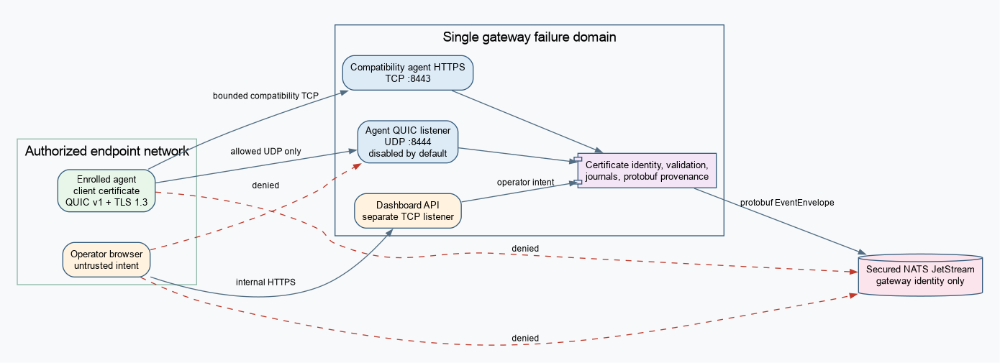

# QUIC Agent Transport Operations

Status date: 2026-07-15.

This runbook describes the required runtime agent transport. It does not by
itself authorize a production deployment.

## Deployment and firewall boundary

The gateway exposes the agent QUIC address as UDP only. The existing agent HTTPS
listener remains TCP/TLS, the administrative dashboard remains a separate
TCP/TLS boundary, and only the gateway reaches NATS. A TCP health check does not
prove UDP reachability.

Editable source: [`quic-agent-deployment.dot`](diagrams/quic-agent-deployment.dot).

The deployment must allow enrolled agents to the configured gateway UDP port,
deny direct agent/browser access to NATS, deny browser access to the QUIC port,
and restrict dashboard access through the existing internal operator network
control. Load balancers, if present, must preserve one QUIC connection's packet
routing. The implemented release supports one gateway instance as the session
ownership failure domain.

## Before enabling a controlled environment

1. Provision externally issued server/client certificates and a client CA;
   remove development credentials from the deployment.
2. Configure persistent reset/token key paths. On first startup the gateway
   independently generates each 32-byte key with the approved CSPRNG and
   atomically stores it owner-only. Back up and rotate them under the deployment
   secret policy; do not derive them from TLS or command keys.
3. Confirm the UDP firewall, NAT idle duration, MTU, receive-buffer policy, and
   kernel drop counters on the actual gateway OS.
4. Set explicit session, handshake, prefix, stream, window, frame, transfer, and
   diagnostic limits from the approved capacity profile.
5. Confirm the release and environment have the approvals recorded in
   `.docs/quic-agent-transport-evidence.md` before deploying it to production.
6. Deploy one allowlisted non-production cohort. Do not dual-publish logical
   events and do not infer readiness from the dashboard TCP health endpoint.

## Monitoring and alerts

The listener exports low-cardinality counters for handshake/certificate/overload
rejection, active/replaced/fenced sessions, decoded/rejected frames, and qlog
sessions/bytes. Application monitoring must also retain broker publication,
command journal, operation journal, transfer, media-drop, process memory,
goroutine, file-descriptor, UDP socket error, and kernel-drop signals.

Alert on sustained increases in handshake or certificate rejection, fallback,
session replacement, fenced frames, replay/conflict, rejected frames, queue
occupancy, broker failures, disk persistence latency/failure, media stale-frame
drops, reconnect rate, UDP errors/drops, or diagnostic bytes. Metrics must not
use raw agent IDs, addresses, certificate contents, paths, or payloads as
unbounded labels.

## Qlog diagnostic window

Qlog is disabled by default. Enable it only for a bounded incident window and a
restricted directory. Files are created owner-only with randomized session
names. Record the start, cohort, retention deadline, and incident owner. Stop
capture after reproducing the issue, collect only through the approved incident
channel, and securely delete it at the deadline. Qlog contains transport timing
and identifiers and remains sensitive even though application payloads are not
intentionally logged.

## Drain and shutdown

Stop new deployment traffic and cancel the gateway runtime context. Each current
session receives a bounded `Drain`, command dequeue stops with the session,
workers are canceled, and the connection closes after the configured drain
window. Durable command state already marked `dispatched` or `accepted` is not
automatically replayed; restart exposes `outcome_unknown` for reconciliation.
Do not kill the process merely because the TCP dashboard drained.

## Incident response

- For certificate or ALPN failures, verify the
  enrollment chain, validity, DNS name, command key ID, clock, and configured
  protocol without recording certificate bodies or private material.
- For a reconnect storm, stop cohort expansion, preserve current durable state,
  inspect UDP/kernel and handshake admission metrics, and reduce new admission
  before resource exhaustion.
- For duplicate/conflicting operations, fence the affected session, preserve
  command/operation/transfer journals, and reconcile by authenticated agent ID
  and operation ID. Never resolve ambiguity by reissuing a side-effecting
  command automatically.
- For broker or disk failure, keep the application acknowledgement failed/busy;
  do not convert transport receipt into a commit claim.
- For suspected credential compromise, revoke enrollment material, drain/fence
  the active session, rotate under the certificate lifecycle process, and audit
  command/journal activity. Revocation of an already established connection
  requires explicit fencing or drain; QUIC does not poll revocation by itself.

## Upgrade, rollback, and recovery

Deploy mixed protocol versions only within the recorded compatibility matrix;
all supported versions use QUIC. Never repeat a committed operation during
rollback. A rollback release must read all forward-written journal/ledger state.

Back up gateway command, operation, and file-workspace state plus independently
managed reset/token keys according to the state-path recovery policy. The client
replay ledger and its authentication key are one recovery unit; restoring one
without the other fails authentication. Loss or corruption fails closed for new
side-effecting commands. Do not reconstruct the key from the client certificate.
After recovery, in-flight accepted/dispatched work remains `outcome_unknown`.

Fleet-wide QUIC requirement, removal of HTTP/WebSocket routes, multi-instance
gateway operation, certificate renewal/revocation policy, and disaster-recovery
approval remain separate gates.
